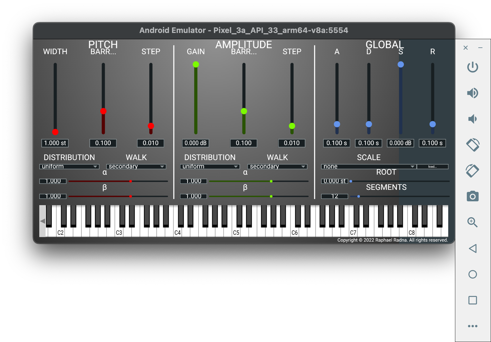
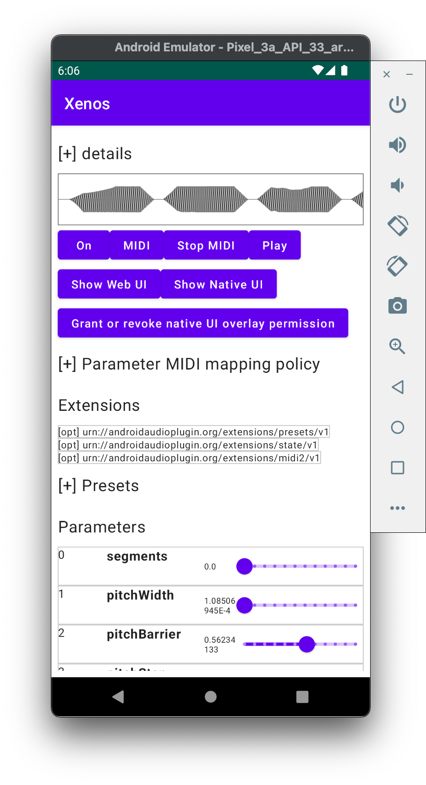

This is a port of [Xenos](https://github.com/raphaelradna/xenos) to [aap-juce](https://github.com/atsushieno/aap-juce).

This time, I created a step-by-step porting guide, copying from [aap-juce-peak-eater](https://github.com/atsushieno/aap-juce-peak-eater/) to this new repo. There will be a new documentation in aap-juce repo.

## LICENSE

Xenos is licensed under the GPLv3 license. aap-juce-xenos follows it and is licensed under the GPLv3 license likewise.
